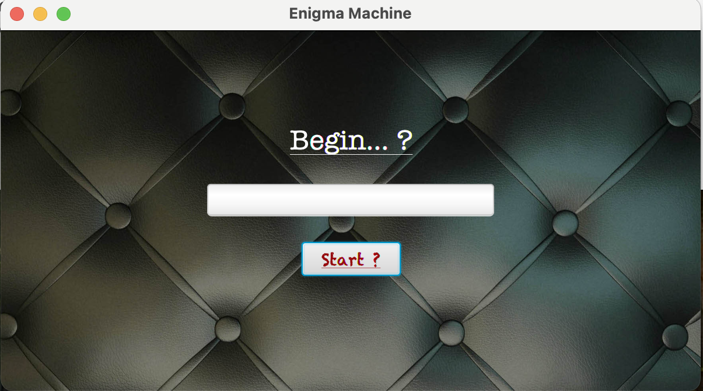
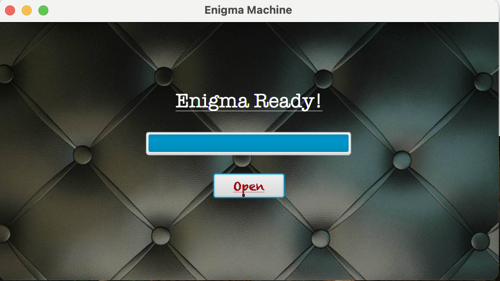

# Enigma Machine - Alan Turing's Design

Designed and developed a sophisticated cybersecurity project in Java and JavaFX, inspired by Alan Turing's iconic Enigma machine. This virtual encryption system replicates the functionality of the historical ciphering device, offering robust message encryption with a capacity to encipher up to 26³ letter combinations. Enhanced with an additional feature to swap 10 letters for heightened encryption complexity, the system ensures that decryption is exclusive to this specific machine, safeguarding the integrity and confidentiality of the encoded messages.

## Requirements

1. **Java Development Kit (JDK)**:
   - Install JDK 11 or later from [Oracle](https://www.oracle.com/java/technologies/javase-downloads.html) or [OpenJDK](https://openjdk.org/).
   - Verify installation by running:
     ```bash
     java -version
     ```

2. **JavaFX SDK**:
   - Download the JavaFX SDK from [Gluon](https://gluonhq.com/products/javafx/).
   - Extract the downloaded archive to a known location (e.g., `/path/to/javafx-sdk`).

## Installation

1. Clone the repository:
   ```bash
   git clone https://github.com/Shiv716/Enigma_Java-JavaFx.git
   cd Enigma


## Usage

To compile the application, use the following command:
 ```
    javac --module-path /path/to/javafx-sdk/lib --add-modules javafx.controls,javafx.fxml -d out/production/Enigma src/EnigmaFolder/MainEnigma.java
 ```
To run the application, use the following command:
 ```
    java --module-path /path/to/javafx-sdk/lib --add-modules javafx.controls,javafx.fxml -cp out/production/Enigma EnigmaFolder.MainEnigma
 ```
**Note**:
   - Replace /path/to/javafx-sdk/lib with the actual path to your JavaFX SDK's lib directory.
   - Replace /path/to/javafx-sdk/lib with the path to your JavaFX SDK's lib directory.

## Enigma Machine






