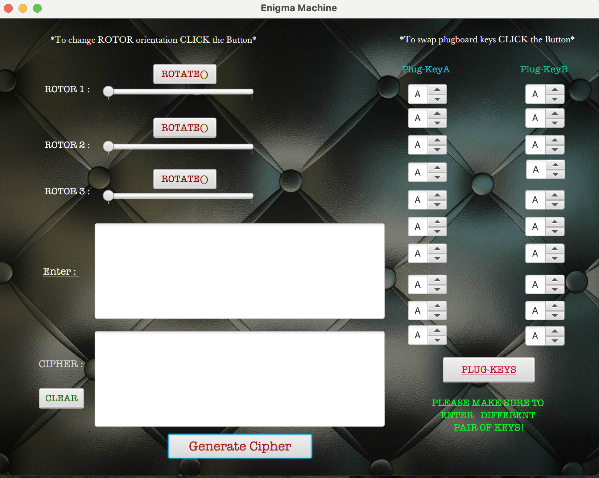

# Enigma Machine - Alan Turing's Design

Designed and developed a sophisticated cybersecurity project in Java and JavaFX, inspired by Alan Turing's iconic Enigma machine. This virtual encryption system replicates the functionality of the historical ciphering device, offering robust message encryption with a capacity to encipher up to 26³ letter combinations. Enhanced with an additional feature to swap 10 letters for heightened encryption complexity, the system ensures that decryption is exclusive to this specific machine, safeguarding the integrity and confidentiality of the encoded messages.

## Requirements
- Java
- JavaFx

## Enigma Machine

